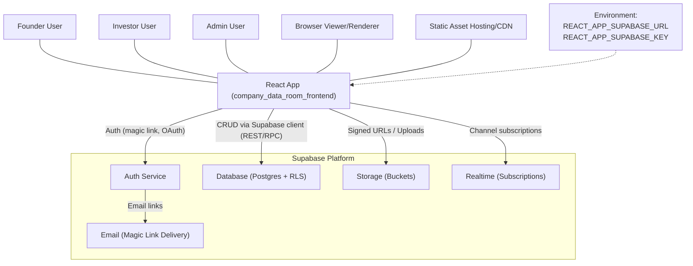
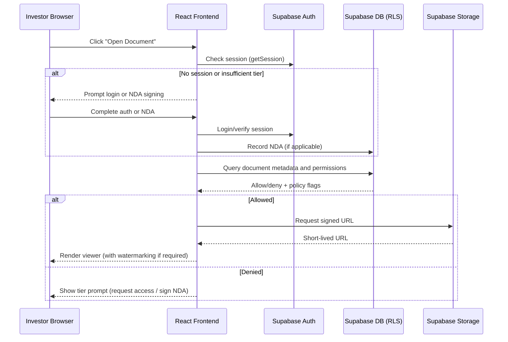
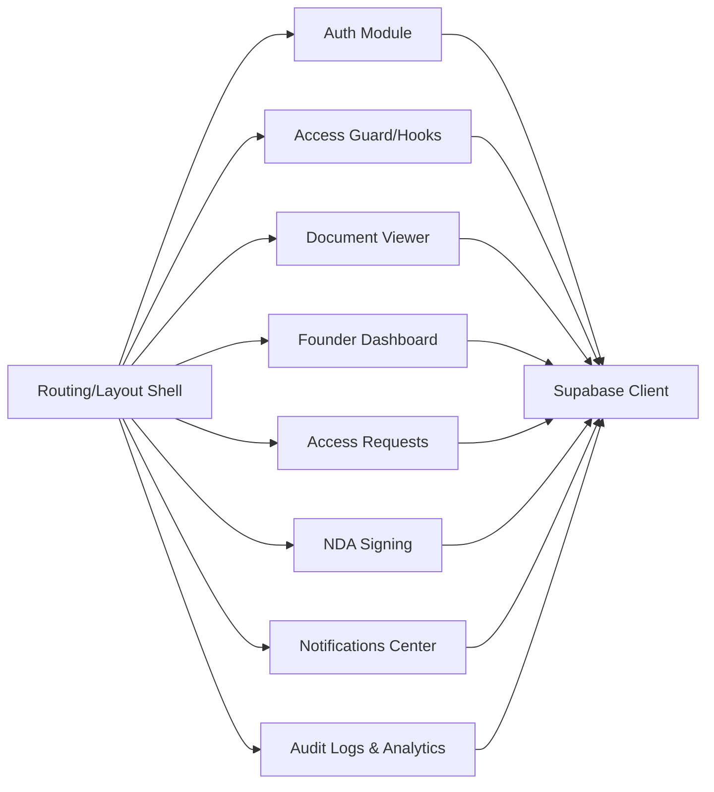
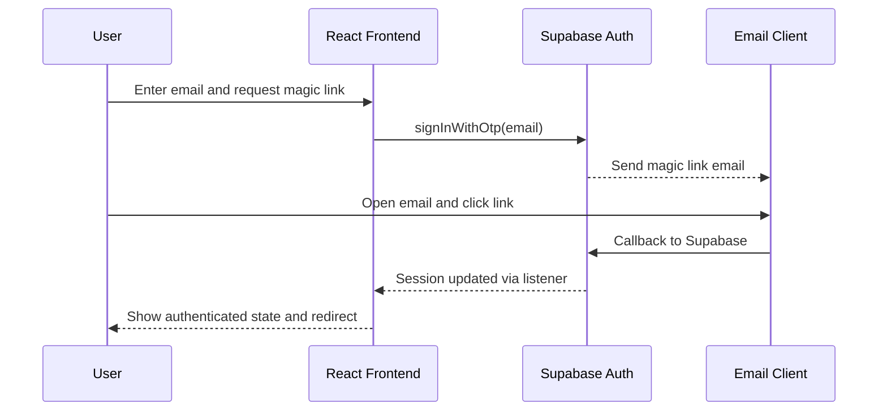

# Technical Architecture Document
Company Data Room Frontend (React) — Secure Startup Fundraising Platform

Version: 1.0  
Container: company_data_room_frontend  
Platform: Web (React)

1. Introduction and Context
This document describes the technical architecture of the React-based frontend for a secure, tiered-access data room enabling startup founders to share documents with investors. It explains the system context, frontend modules, integration with Supabase for authentication and data access, and how access tiers are enforced at the UI level in coordination with backend policies. The current codebase is a minimal Create React App baseline with a theme toggle, and this architecture outlines the evolution toward the required capabilities defined in the PRD.

2. System Context Overview
The frontend is the primary user interface for three roles: Founder, Investor, and Admin (operations/support). It interacts with Supabase services for:
- Authentication (magic link/passwordless and optional OAuth).
- Data persistence and access control rules (via Postgres with Row-Level Security and Supabase APIs).
- File storage for documents (Supabase Storage buckets).
- Realtime subscriptions for notifications and live updates.

Frontend enforcement of access is advisory. The canonical enforcement is handled via Supabase Row-Level Security (RLS), signed URLs for downloads, and controlled API responses. The frontend must present clear affordances, guide access requests, and reflect tier status in the UI.

Mermaid: System Context Diagram

3. Frontend Architecture and Major Modules
The frontend follows a modular architecture organized around feature domains. Modules communicate through shared hooks, a state management approach (React state with potential context/hooks; a minimal approach is favored initially), and typed service clients for Supabase.

- App Shell and Routing/Layout
  The App component bootstraps the layout and routing with a dashboard-oriented UI. The layout provides a persistent sidebar for navigation, a top context bar, and a main content area for document previews and dashboards. The initial codebase provides theme management (light/dark) and will extend to include role-aware navigation.

- Authentication Module
  The authentication module wraps Supabase auth flows (email magic link and optional OAuth providers). It exposes hooks for auth state (user, session), utilities for login/logout, and guards that gate routes and components based on tier. On auth state changes, the module updates the UI and initiates data refreshes (e.g., access requests or tier status).

- Access Control Guard and Tier Logic
  Client-side route guards and component wrappers check computed tier (public, qualified, NDA-signed) derived from user session and backend attributes. The module interprets backend responses and metadata to render prompts (authenticate, request access, sign NDA) and shields sensitive UI actions. Final authorization is confirmed through backend responses and signed URLs.

- Document Viewer Module
  Inline document previewers (e.g., for PDFs/images) with optional anti-exfiltration UX like watermark overlays. The viewer requests signed URLs from the backend/Supabase Storage and respects download restrictions by design (no visible direct download link when disabled and short-lived signed URLs). The module also shows metadata and an audit-friendly activity summary.

- Upload and Management (Founder Dashboard)
  Upload flows for founders to create structured sections (pitch, financials, product, legal) and set visibility policies (tier per file/folder). The module integrates with Supabase Storage and coordinates with backend metadata tables for indexing, policies, and analytics. Batch operations and drag-and-drop are planned.

- Access Requests (Investor Flow)
  Investor-facing flows for requesting higher-tier access. The module collects minimal information, submits requests to the backend, and tracks status via realtime updates or polling. Contextual modals guide the investor from public content to qualified access.

- NDA Signing
  An embedded modal flow presents the NDA content and captures signatures. For MVP, this can be stubbed in the UI and stored as an acceptance record with timestamp, user, and document version. The signed state changes authorization for NDA-protected content.

- Notifications Center
  In-app notifications summarize access events, approvals, NDA completion, and document changes. Realtime subscriptions (via Supabase Realtime) or server-driven events update the notification center and render non-intrusive toasts.

- Audit Log Viewer and Analytics
  Founder-facing pages to review audit events (views, downloads, signatures) and summary analytics. The module supports filtering and export of logs for due diligence and internal review.

4. Interfaces and Integration Points
- Supabase Auth
  The frontend uses the Supabase JavaScript client to initiate email magic link flows. Optional OAuth provider buttons can be enabled. After authentication, the frontend updates state and refetches permissions and tier status. Sessions are persisted with secure browser storage.

- Database Access (REST/RPC via Supabase Client)
  The frontend queries and mutates data through Supabase’s client, which is subject to RLS. The database stores document metadata, access requests, NDA signatures, and audit events. The frontend never bypasses RLS; unauthorized attempts result in 401/403 which are rendered as UI prompts (e.g., sign NDA or request access).

- Storage Access
  The frontend obtains signed URLs for document previews and downloads through the Supabase client. Sensitive files are only accessible with short-lived signed URLs. Configurable policies allow download suppression and watermarking in the viewer.

- Realtime
  The frontend subscribes to changes for access requests, NDA completion, and notifications, improving responsiveness of the UI. Subscriptions are scoped to the authenticated user or workspace to minimize data exposure.

- Email and Notifications
  Magic link emails originate from Supabase Auth configuration. The frontend also triggers or receives signals for email notifications related to access requests and NDA status via backend logic; UI displays in-app notifications.

5. Data Flows
- Public browsing of non-sensitive content
  The investor lands on a public overview page and previews allowed documents. The app performs unauthenticated reads where permitted by RLS. Links or calls to action guide the user to authenticate for higher access.

- Auth and tier elevation to Qualified
  The investor initiates email magic link login. On success, the frontend loads the user profile and access rules. RLS-backed queries return additional documents and metadata based on qualified status.

- NDA signature and sensitive document access
  Attempting to open NDA-protected content triggers the NDA modal. Upon signature capture and confirmed record creation, the frontend refetches permissions; the viewer then requests a signed URL and renders the document with watermarking as applicable.

Mermaid: Access Tier Enforcement (Sequence)

6. Access Management and Tier Enforcement
- Tier Determination
  The tier is computed from authenticated user attributes and backend records (qualification status, NDA signature). The frontend reads tier-relevant fields from RLS-protected tables and caches them in memory for rendering. The presence of an authenticated session is not sufficient; successful reads from tier-gated endpoints are the signal that access is granted.

- UI Guardrails
  Routes, menu items, and actions are conditionally displayed based on tier. Tooltips and inline messages explain what is locked and the path to unlock (authenticate, request access, sign NDA). When the backend denies access, the UI falls back to prompts rather than attempting retries.

- Download Protection
  For NDA-protected content, the viewer does not expose direct download controls when policy forbids it. All renders rely on short-lived signed URLs and, where applicable, dynamic watermark overlays that include user email and timestamp for deterrence.

7. Security Strategies
- Authentication and Session
  Authentication is handled through Supabase Auth. The frontend initiates magic link requests and tracks session state. Sensitive actions require a valid session; tokens are never stored in insecure contexts. Sign-out clears local session state.

- Principle of Least Privilege
  The frontend requests only the data required for the current view. Queries are scoped and paginated. RLS on the backend enforces least privilege and prevents over-fetching.

- Sensitive Data and Secrets
  No secrets are embedded in the frontend. Only REACT_APP_SUPABASE_URL and REACT_APP_SUPABASE_KEY are configured, and the key is a public anon key appropriate for client usage. Private keys remain server-side.

- Transport and Storage
  All communication occurs over HTTPS. The application avoids writing sensitive data to local storage beyond what is necessary for session continuity and user preferences. Downloadable content is mediated by signed URLs.

- Auditability
  The frontend surfaces audit data returned by the backend. It does not generate authoritative audit records; it triggers actions that the backend records immutably (e.g., view events via RPC or edge functions).

8. Error Handling and Resilience
- Network and Auth Errors
  Components render actionable error messages for 401/403 (login or NDA prompts) and 5xx (retry guidance). Exponential backoff may be used for transient failures. The UI includes a system status banner for incidents affecting authentication or file viewing.

- Misconfiguration Handling
  If REACT_APP_SUPABASE_URL or REACT_APP_SUPABASE_KEY are missing, the app shows a developer-facing configuration error in non-production environments. Production builds should fail fast in CI if required env vars are not provided.

9. Configuration and Environment
The frontend reads two environment variables at build time:
- REACT_APP_SUPABASE_URL
- REACT_APP_SUPABASE_KEY

These values configure the Supabase client. The app must validate presence and provide a clear message when absent during development. Different environments (dev, staging, prod) will provide different URLs and anon keys.

10. UX, Layout, and Responsiveness
The layout is a responsive dashboard with a sidebar for navigation, a document preview area, and modals for access control, signatures, uploads, and requests. The current codebase implements theme toggling and a modern, minimal style. Accessibility (WCAG AA) is a core requirement; keyboard navigation and ARIA roles for modals must be implemented consistently.

11. Build, Quality, and Conventions
The project uses Create React App with ESLint configured in eslint.config.mjs. The codebase favors functional components, hooks, and a lightweight state strategy. Testing covers critical flows such as authentication prompts, NDA modal, and gated document viewing. Linting and tests run in CI.

12. Planned Component Boundaries and Data Contracts
- Auth Client
  Provides functions like signInWithEmail, signOut, getSession, and event listeners for auth changes. Exposes isAuthenticated and profile metadata compliant with backend schema.

- Data Services
  Thin client services wrap Supabase calls for documents, access requests, signatures, and logs. Each service returns typed responses and normalized errors for consistent handling.

- View Models and Hooks
  React hooks like useTier, useDocuments, useAccessRequests encapsulate data fetching and derive UI state (loading, empty, error).

- UI Components
  The UI library consists of navigational shell, list/grid for documents, modular viewer, and modals. Components are tier-aware via context/hooks and avoid embedding direct Supabase calls when possible (delegated to services).

13. Example Module Interaction
Mermaid: Module Interaction Diagram

14. Sequence: Magic Link Authentication
Mermaid: Magic Link Flow

15. Deployment and CDN
The frontend is built with react-scripts and deployed to a static hosting environment with CDN. All dynamic operations occur through Supabase endpoints. Cache policies should be tuned so that critical HTML is not cached aggressively, while static assets benefit from long TTLs. Realtime features require persistent WebSocket connections.

16. Open Questions and Assumptions
- Detailed database schema and RLS policies are defined in the backend repository and are assumed to exist for tiers, access requests, and NDA records.
- E-signature integration may start as an inline acceptance record; third-party signature vendors can be integrated later.
- Watermarking is implemented at the viewer level; stronger DRM is out of initial scope.

17. References
- Codebase
  - src/App.js, src/App.css (theme and baseline UI)
  - src/index.js (app bootstrap)
  - package.json (React and scripts)
  - eslint.config.mjs (lint rules)
  - company_data_room_frontend/README.md (template usage and customization)
- PRD
  - kavia-docs/PRD_company_data_room_frontend.md for product scope and user goals

End of Document
